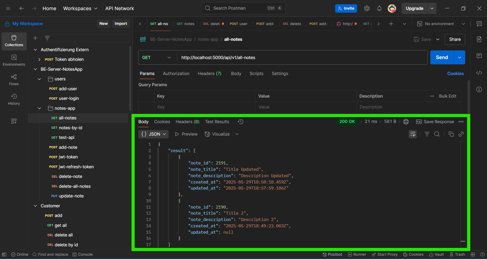

# README 
React Native Project

## Fix lint errors
To fix all lint erros, run commands below at the root directory of the project.
``` 
npm run lint
npm run lint-fix
```

# Start Project
Open the terminal and go to root-directory of the project.
Run command below.
```
npm start

# Note: 
- Before running the Mobile App, run the backend server in the local env
  `https://github.com/satheeshpolu/backend-application` 
- Update the IP address of the backend server in the `.env` file to save the notes data via Mobile app
   `http://192.168.29.146:5000/api/v1/all-notes`

```

# Setup react-native-dotenv package
Open the terminal and go to root-directory of the project.
Run command below.
```
npm install react-native-dotenv

Note: For uninstall react-native-dotenv package run command => npm uni react-native-dotenv or npm uninstall react-native-dotenv
```

# Mobile App Flow


